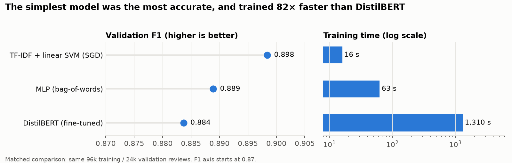

# Amazon Review Sentiment: Simple Beats Complex

**Binary sentiment classification on 4 million Amazon reviews, comparing TF-IDF linear models, a neural network and fine-tuned DistilBERT, with leakage-safe evaluation and a locked test set.**

`Python` · `scikit-learn` · `PyTorch` · `Hugging Face Transformers (DistilBERT)` · `sentence-transformers` · `pandas` · `matplotlib`



## Business question

An e-commerce team wants to flag negative reviews automatically so support can respond quickly. Which model gives the best accuracy for the cost of training and running it?

## Results

| | Result |
|---|---|
| **Locked test set** (400,000 held-out reviews) | **F1 0.906 · accuracy 90.5% · ROC-AUC 0.966** |
| **5-fold cross-validation** | F1 0.907 ± 0.001: stable, no sign of overfitting |
| **Simple beats complex** | On the same 120k-review subset, TF-IDF + linear SVM (F1 0.898) outperformed fine-tuned DistilBERT (0.884) and trained **82× faster** |
| **Scale matters more than architecture** | Growing training data from 96k to 400k rows lifted F1 from 0.898 to 0.907; switching to DistilBERT lowered it |

**Recommendation:** deploy TF-IDF + linear SVM (SGD). It is the most accurate, trains in seconds, runs on a CPU, and its word weights are explainable to stakeholders. Revisit transformers only if negation and sarcasm errors become a measured business problem and a GPU budget exists.

## Method

1. **Data quality & EDA**: class balance, review length, top terms, and the "good paradox" (*"not good"*) negation problem
2. **Baselines**: TF-IDF (1–2 grams) with logistic regression, linear SVM (SGD) and random forest
3. **Feature ablation**: does review length add signal? (+0.001 F1, so it was left out)
4. **Unsupervised discovery**: TF-IDF → SVD → k-means vs sentence-embedding clusters
5. **Neural comparison**: bag-of-words MLP and fine-tuned DistilBERT on a matched subset
6. **Evaluation integrity**: leakage audit (vectorizer fit inside the pipeline, test file not loaded until the end), 5-fold CV, one locked evaluation on the test file

| Model (matched 96k train / 24k val) | F1 | ROC-AUC | Train time |
|---|---|---|---|
| TF-IDF + linear SVM (SGD) | **0.898** | **0.962** | 16 s |
| MLP (bag-of-words) | 0.889 | 0.954 | 63 s |
| DistilBERT (fine-tuned) | 0.884 | 0.949 | 1,310 s |

## Read the analysis

📓 **[Executed notebook with all outputs](final_notebook_executed.ipynb)** · 📊 [Slides](Amazon_Sentiment_Architecture.pptx)

## Reproduce

```bash
python3 -m venv .venv && source .venv/bin/activate
pip install -r requirements.txt
# Download https://www.kaggle.com/datasets/bittlingmayer/amazonreviews
# and place train.ft.txt and test.ft.txt in data/
jupyter nbconvert --to notebook --execute final_notebook.ipynb \
  --output final_notebook_executed.ipynb --ExecutePreprocessor.timeout=-1
```

Full execution takes several hours on CPU (the transformer section dominates).

## Data

[Amazon Reviews for Sentiment Analysis](https://www.kaggle.com/datasets/bittlingmayer/amazonreviews) (fastText format): 3.6M training and 400k test reviews, labelled positive (4–5★) or negative (1–2★). The data files aren't stored in this repo.

---
*Final project, Information Architecture, M.S. Data Analytics & Visualization, Yeshiva University (Spring 2026). Tapiwa Mutarimanja.*
